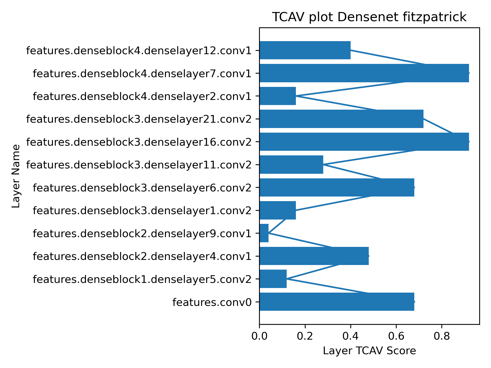

# Setup Instructions 
- install the conda enviroment to esure compatability of packages. 
```bash 
 conda create --name jbi --file jbi_env.yml
 ```
 - Enviroment was developed using python3 3.9 and CUDA 12.2

# Preparing datasets 
 -  The code expects you define a pytorch dataset  that is able to load 1 image at a time
 - In our workflows we usually provide a csv file that contains image paths,labels , train/test grouping and other metdata 
 -  if working on your own imaging modality create a new {modality}_factor.py where you define data  loaders 
 -  Each factory.py has a get_loaders method that is used to load specific dataloaders. 
   - We do this so we can  have dataloaders that provide 2-3 based on our training experiments 
 - The code right now expects the dataloaders to output 
   - Baseline Dataloaders : (image,task_label,path_to_image) 
   - Debiasing Dataloaders : (image,task_label,demographic_label,path_to_image)
- if you define your own loader modify loader_factory.py to load said object. 

# Running HyperParameter Search  
 - Once a dataloader is defined we are able to run experiments using resnet18 and densenet121. 
 - We can run a parameter search sweep using: 
 - This will help us define our baseline model with "ideal" parameters. 
```bash 
bash ./scripts/step0_run_param_search.sh
```
# Training Baseline Model  
 - There is a notebook  notebooks/view_optuna_dashboard.ipynb  where we can view the best hyper parameters based on validation loss 
 - Modify configs/skin_configs/train_skin.json with the best hyper parameters 
 - Train the baseline model using: 
```bash 
bash ./scripts/step1_run_best_models.sh
```
#  Observing TCAV in model layers 
 - modify configs/skin_configs/tcav_experiment_config.json  to point at your data and your model weights 
 - Run the Following  script: 
 ```bash
 bash ./scripts/step2_run_tcav.sh
 ``` 
 - We should get an image simlar to:
 
 - From those results our "debiasing" taret will be 
 - "model.features.denseblock3.denselayer16.conv2"
   - NOTE: We add the "model" because our debias training uses module that wraps around the network so 
   - features.denseblock becomes model.features.denseblock
# Grid search for adversarial Debiasing
 - configs/skin_configs/param_searches/param_search_debias.json should have the same parameters as the baseline network training configs/skin_configs/train_skin.json. we will only search over possible lambda values. 
 - leaving out batch_size and optimizer will result  varying optimal configurations. Resulting in unfair comparisons. 
 ```bash 
 bash scripts/step3_run_debias_param_search.sh
 ```
 - The notebook can be used to view the best parameters. notebooks/view_optuna_dashboard.ipynb  

 # Run and evaluate the final model 
 - Once your hyper paramters are update run 
 ```bash   
 bash scripts/step4_run_debi
 ``` 
 