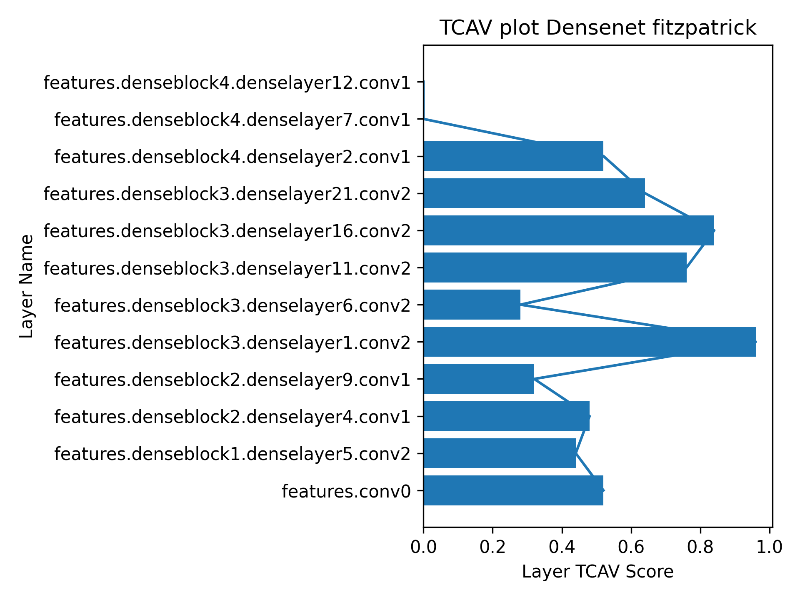

#Note: 
- Prior code was difficult to use. This branch is being used to update the code for better reproducibility.
- The original code can be found in the "main" branch.
- This branch will be "updated" by default for now.

# Setup Instructions 
- Install the conda environment to ensure the packages are compatible. 
```bash 
 conda create --name jbi python=3.10.18
python3 -m pip install -r ./reqs.txt
python3 -m pip install -e . 
 ```

# Download the fitz17k dataset 
```bash
python3 -m jbi.exp_setup.skin_cancer.skin_cancer_utils --mode download_fitz --output_csv /media/Datacenter_storage/ramon_dataset_curations/skincancer_project/data/csvs/fitz17k.csv \
--local_csv_path /media/Datacenter_storage/ramon_dataset_curations/skincancer_project/data/csvs/fitz17k.csv \
--data_root /media/Datacenter_storage/MADHU/skin_cancer/deployement_pipeline/app/test/test_images/data/finalfitz17k/ \
--mask_data_root /media/Datacenter_storage/MADHU/skin_cancer/deployement_pipeline/app/test/test_images/data/fitzpatrick_segmentation_masks_fine-tuned_BiomedParse/mask_images/
```
### Hyper Parameters for Baseline Model 
- NOTICE: On the asu server there are issues with the network drive. So optuna logs are stored in a  home directory instead 

```bash 
python3 -m jbi.exp_setup.skin_cancer.baseline.make_baseline_optim --csv_path /mnt/storage/ramon_data_curations/skin_cancer_redo/data/csvs/fitz17k.csv \
--config_dir /mnt/storage/ramon_data_curations/skin_cancer_redo/data/configs/optims/baseline \
--optuna_log_dir /home/ramon/optuna_logs/baseline
```
- NOTE: For some reason optuna hs an issue writitng its log.db file to certain network drive. Therefore it's suggested you use local storage or another file type? 


### Make best training config
```bash 
python3 -m jbi.exp_setup.skin_cancer.baseline.make_best_train --csv_path /mnt/storage/ramon_data_curations/skin_cancer_redo/data/csvs/fitz17k.csv \
--config_dir /mnt/storage/ramon_data_curations/skin_cancer_redo/data/configs/model_dev/baseline \
--log_dir /mnt/storage/ramon_data_curations/skin_cancer_redo/data/model_logs/model_dev/baseline \
--optuna_log /home/ramon/optuna_logs/baseline/optuna_log.db
 
```

# Training the multi-task model 
```bash 
python3 -m jbi.exp_setup.skin_cancer.two_task.make_twoTask --csv_path /mnt/storage/ramon_data_curations/skin_cancer_redo/data/csvs/fitz17k.csv \
--config_dir /mnt/storage/ramon_data_curations/skin_cancer_redo/data/configs/model_dev/two_task \
--log_dir /mnt/storage/ramon_data_curations/skin_cancer_redo/data/model_logs/model_dev/two_task \
--optuna_log /home/ramon/optuna_logs/baseline/optuna_log.db
```
# TCAV 

```bash 
python3 -m jbi.exp_setup.skin_cancer.tcav.make_tcav_plot --csv_path /mnt/storage/ramon_data_curations/skin_cancer_redo/data/csvs/fitz17k.csv \
--log_dir /mnt/storage/ramon_data_curations/skin_cancer_redo/data/model_logs/tcav_viz \
--weight_path /mnt/storage/ramon_data_curations/skin_cancer_redo/data/model_logs/model_dev/two_task/model_w.ckpt \
--config_dir /mnt/storage/ramon_data_curations/skin_cancer_redo/data/configs/tcav_viz

```
```bash 
    python3 -m jbi.train --config_path jbi/config/tcav_explore.json
```
#  Observing TCAV in model layers 
 - modify jbi/config/tcav_explore.json  to point at your data and your model weights 
 - Run the Following  script: 
 ```bash
 python3 -m jbi.tcav --config_path ./jbi/config/tcav_explore.json
 ``` 
 - We should get an image simlar to:
 
 - From those results our "debiasing" target will be 
 - "model.features.denseblock3.denselayer16.conv2"

# Training Debiased model 
```bash 
python3 -m jbi.exp_setup.skin_cancer.adversarial.make_adversarial_optim --csv_path /mnt/storage/ramon_data_curations/skin_cancer_redo/data/csvs/fitz17k.csv \
--config_dir /mnt/storage/ramon_data_curations/skin_cancer_redo/data/configs/optims/adversarial_tcav \
--optuna_log_dir /mnt/storage/ramon_data_curations/skin_cancer_redo/data/model_logs/optuna/adv_tcav

```
 ```bash
 python3 -m jbi.train --config_path ./jbi/config/train_adv_tcav.json 
 ```

# Other Modifications 
The model training code will now output predictions for each dataset split in the log_dir folder specified.
- Hyperparameter tuning was removed but will be added
- So will be the code for generating embeddings
